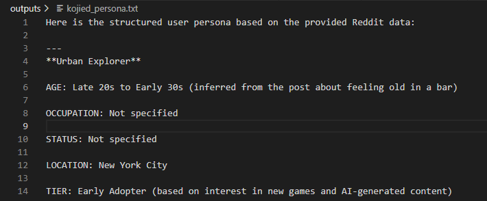
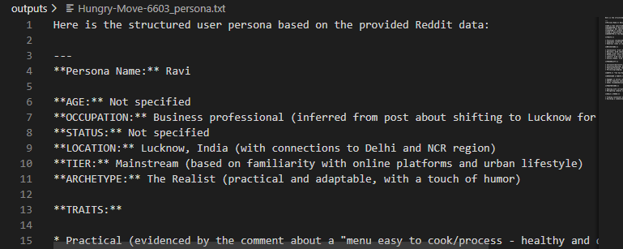

#  RedditReveal: AI-Driven Persona Builder 🧠

This Python project analyzes a Reddit user's activity and generates a detailed user persona using the Llama 3 model via OpenRouter. Each persona includes motivations, personality traits, behavior habits, frustrations, and goals — all cited from the user's own Reddit posts and comments.

The persona includes:

- Demographics (Age, Occupation, Status, Location, etc.)
- Personality traits and motivations (with bar/score visualizations)
- Behaviours & habits
- Frustrations
- Goals & needs
- A representative quote
- **Citations** for every insight (links to the Reddit posts/comments used)

All insights are generated using **Meta’s Llama 3 LLM** (via OpenRouter API) for rich, evidence-based summaries.

---

##  Folder Structure
    RedditReveal--AI-Driven-Persona-Builder/
    ├── main.py
    ├── requirements.txt
    ├── README.md
    ├── outputs/
    └── .env

## How It Works

1. **Input:**  
   You provide a Reddit user profile URL (e.g. `https://www.reddit.com/user/kojied/`).

2. **Scraping:**  
   The script fetches up to 50 recent posts and comments from the user's public Reddit history.

3. **Persona Generation:**  
   It sends this data to Meta’s Llama 3 LLM (via OpenRouter) with a custom prompt to generate a persona in the format above, citing specific posts/comments for each insight.

4. **Output:**  
   The persona is saved as a `.txt` file in the `outputs/` folder (e.g. `outputs/kojied_persona.txt`).

---
## Setup Instructions

### 1. Clone the Repository
    git clone https://github.com/atharvramgir/RedditReveal--AI-Driven-Persona-Builder.git
    cd RedditReveal--AI-Driven-Persona-Builder

### 2. Install Dependencies

Make sure you have Python 3.8+ installed.
 
    pip install -r requirements.txt

### 3. Configure API Keys

Create a `.env` file in the project root with the following content:

    REDDIT_CLIENT_ID=your_reddit_client_id
    REDDIT_CLIENT_SECRET=your_reddit_client_secret
    REDDIT_USER_AGENT=persona-script
    OPENROUTER_API_KEY=your_openrouter_api_key

- [Get Reddit API credentials here.](https://www.reddit.com/prefs/apps) (Create a "script" app.)
- [Get an OpenRouter API key here.](https://openrouter.ai/)

### 4. Run the Script

    python main.py

## Example Usage

    Enter Reddit user profile URL: https://www.reddit.com/user/Hungry-Move-6603/
    Fetching data for user: Hungry-Move-6603...
    Found 2 posts and 10 comments.
    
## LLM response:
    Here is the structured user persona based on the provided Reddit data:

    ---
    **Persona Name:** Ravi

    **AGE:** Not specified
    **OCCUPATION:** Business professional (inferred from post about shifting to Lucknow for business purposes)
    **STATUS:** Not specified
    **LOCATION:** Lucknow, India (with connections to Delhi and NCR region)
    **TIER:** Mainstream (based on familiarity with online platforms and urban lifestyle)
    **ARCHETYPE:** The Realist (practical and adaptable, with a touch of humor)
    .
    .
    .
    Persona saved to outputs\Hungry-Move-6603_persona.txt
    Done!

see the outputs\Hungry-Move-6603_persona.txt for full text

> ⚠️ **Note**: Never commit your `.env` file to GitHub! Keep your API keys private.

## 📄 Sample Output Snippet

##  Tested Reddit Users

- [kojied](https://www.reddit.com/user/kojied/) – active in finance and data subs  
- [Hungry-Move-6603](https://www.reddit.com/user/Hungry-Move-6603/) – business-oriented with regional commentary  

----

**Developer:** Atharva Ramgir
**Email:** atharva.ajinkya.ramgir@gmail.com
**GitHub:** [github.com/atharvramgir](https://github.com/atharvramgir)  
